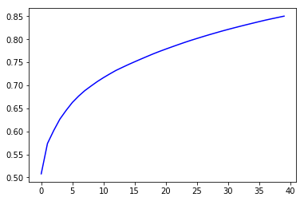
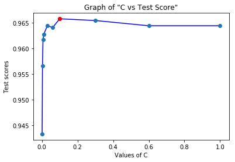

# Human Activity Recognition
 Human Activity Recognition (HAR) is a multi-classfication project using <a title=" Human Activity Recognition Using Smart Phones" href="https://archive.ics.uci.edu/ml/datasets/Human+Activity+Recognition+Using+Smartphones" >Human Activity Recognition Using Smartphones</a> UCI dataset to classify Human Actions among six categories :

- WALKING,
- WALKING_UPSTAIRS,
- WALKING_DOWNSTAIRS,
- SITTING,
- STANDING,
- LAYING.

# DESCRIPTION OF DATASET
#### Human Activity Recognition Using Smartphones Dataset - Version 1.0

The experiments have been carried out with a group of 30 volunteers within an age bracket of 19-48 years. Each person performed six activities (WALKING, WALKING_UPSTAIRS, WALKING_DOWNSTAIRS, SITTING, STANDING, LAYING) wearing a smartphone (Samsung Galaxy S II) on the waist. Using its embedded accelerometer and gyroscope, we captured 3-axial linear acceleration and 3-axial angular velocity at a constant rate of 50Hz. The experiments have been video-recorded to label the data manually. The obtained dataset has been randomly partitioned into two sets, where 70% of the volunteers was selected for generating the training data and 30% the test data. 

The sensor signals (accelerometer and gyroscope) were pre-processed by applying noise filters and then sampled in fixed-width sliding windows of 2.56 sec and 50% overlap (128 readings/window). The sensor acceleration signal, which has gravitational and body motion components, was separated using a Butterworth low-pass filter into body acceleration and gravity. The gravitational force is assumed to have only low frequency components, therefore a filter with 0.3 Hz cutoff frequency was used. From each window, a vector of features was obtained by calculating variables from the time and frequency domain. See 'features_info.txt' for more details. 

For each record it is provided:
======================================

- Triaxial acceleration from the accelerometer (total acceleration) and the estimated body acceleration.
- Triaxial Angular velocity from the gyroscope. 
- A 561-feature vector with time and frequency domain variables. 
- Its activity label. 
- An identifier of the subject who carried out the experiment.

The dataset includes the following files:
=========================================

- 'README.txt'

- 'features_info.txt': Shows information about the variables used on the feature vector.

- 'features.txt': List of all features.

- 'activity_labels.txt': Links the class labels with their activity name.

- 'train/X_train.txt': Training set.

- 'train/y_train.txt': Training labels.

- 'test/X_test.txt': Test set.

- 'test/y_test.txt': Test labels.

The following files are available for the train and test data. Their descriptions are equivalent. 

- 'train/subject_train.txt': Each row identifies the subject who performed the activity for each window sample. Its range is from 1 to 30. 

- 'train/Inertial Signals/total_acc_x_train.txt': The acceleration signal from the smartphone accelerometer X axis in standard gravity units 'g'. Every row shows a 128 element vector. The same description applies for the 'total_acc_x_train.txt' and 'total_acc_z_train.txt' files for the Y and Z axis. 

- 'train/Inertial Signals/body_acc_x_train.txt': The body acceleration signal obtained by subtracting the gravity from the total acceleration. 

- 'train/Inertial Signals/body_gyro_x_train.txt': The angular velocity vector measured by the gyroscope for each window sample. The units are radians/second. 

Notes: 
======
- Features are normalized and bounded within [-1,1].
- Each feature vector is a row on the text file.
- The units used for the accelerations (total and body) are 'g's (gravity of earth -> 9.80665 m/seg2).
- The gyroscope units are rad/seg.

Approach :
===========
I have used three classical algorithms to perform multi-classification namely
- Logistic Regression
- Support Vector Classifier
- Random Forest Classifier

Importing Libraries :
========
```python
import numpy as np
import pandas as pd
import matplotlib.pyplot as plt
from sklearn.preprocessing import StandardScaler
```

PRE-PROCESSING :
=========
It is a good practice to perform feature scaling and mean normalization before applying models like Logistic Regression, SVM, etc. 
```python
df_train = pd.read_csv('train/X_train.txt', delim_whitespace=True, header=None)
df_test = pd.read_csv('test/X_test.txt', delim_whitespace=True, header=None)

combine = pd.concat([df_train, df_test])

y_train = np.array(pd.read_csv('train/y_train.txt', header=None)).ravel()
y_test = np.array(pd.read_csv('test/y_test.txt', header=None)).ravel()
df_train.shape, df_test.shape, combine.shape

stdScaler = StandardScaler()
X = stdScaler.fit_transform(combine.values)
X_train = stdScaler.fit_transform(df_train.values)
X_test = stdScaler.fit_transform(df_test.values)
```
Should we use PCA ?
====================
Since, the dataset contains 10299 instances and 561 attributes. The number of attributes is quite high so it might take time to train the model. Also, large number of attributes can lead to Overfitting. If the model overfits because of large number of attributes, we can use **Principal Component Analysis** (PCA) to reduce the number of attributes so that the model will contain new useful features. But when i trained my model on Logistic, SVM and Random Forest, i observed that the Training Score and Test Score is quite close. It means that our model performs equally good on Training Set and Test Set. This implies that our model do not Overfit, so we do not need to apply PCA here. We can verify that PCA will not increase the Test Score. Before applying PCA, we need to perform Data Centralization. Data centralization is a major step before applying PCA to a Training Set. On applying PCA for the model with variance 0.9, we observe that around only 63 principal components are required and with variance 0.85, around only 40 principal components are required. We will stick with 0.85 variance as a thumb of rule (it is observed that variance "0.85" often suits many models quite well).
```python
from sklearn.decomposition import PCA

pca = PCA(n_components=0.85, random_state=42) 
pca = pca.fit(X_train)
Xtrain_pca = pca.transform(X_train)
Xtest_pca = pca.transform(X_test)

```
```python
pca_csum = pca.explained_variance_ratio_.cumsum()
display(pca_csum)
pca_csum_list = []
for i in range(len(pca_csum)) :
    pca_csum_list.append(pca_csum[i])
plt.plot(pca_csum_list, 'b')
plt.show()
```

``` python
stdScaler = StandardScaler()
X_train = stdScaler.fit_transform(Xtrain_pca)
X_test = stdScaler.transform(Xtest_pca)
```

# Applying Logistic Regression
Here, we are using Logistic Regression with "liblinear" solver. LIBLINEAR is an open source library for large-scale linear classification. Logistic Regression is performing really great with 96.87% accuracy.
```
from sklearn.linear_model import LogisticRegression

d=[0.001, 0.003, 0.006, 0.01,0.03,0.06,0.1,0.3,0.6, 1]
max_train = 0
max_test = 0
optimalC = d[0]
c_list = []
for i in d:
    
    clf = LogisticRegression(C=i, penalty='l2', random_state=42)
    clf.fit(X_train, y_train)
    score_train = clf.score(X_train, y_train)
    score_test = clf.score(X_test, y_test)
    
    c_list.append(score_test)
    if(score_test > max_test) :
        max_test = score_test
        max_train = score_train
        optimalC = i

print("Optimal C = ", optimalC)
print("Training score by Logistic Regression (liblinear) : ", max_train)
print("Test score by Logistic Regression (liblinear) : ", max_test)
plt.plot(d, c_list, 'b', d, c_list, 'o')
plt.plot(d[d.index(optimalC)], c_list[d.index(optimalC)], 'ro')
plt.xlabel("Values of C")
plt.ylabel("Test scores")
plt.title("Graph of \"C vs Test Score\"")
plt.show()
```
### Graph of C vs Test Score (without PCA)

### Output of Logistic Regression without PCA
```
Optimal C =  0.1
Training score by Logistic Regression (liblinear) :  0.9883025027203483
Test score by Logistic Regression (liblinear) :  0.9657278588394977
```
### Output of Logistic Regression with PCA
```
Optimal C =  1
Training score by Logistic Regression (liblinear) :  0.9333514689880305
Test score by Logistic Regression (liblinear) :  0.9182219205972175
```
# Observation 
Clearly, Result without PCA is quite better than that with PCA. Also, Training score and test score are quite close as well. So, the decision of not using PCA was not wrong. I also tried with other different models like SVM, Random Forest, etc. with PCA and without PCA and each case, not using PCA was the optimal choice. So, from now on, we will not consider the case of using PCA.
 # Applying Support Vector Classifier (SVC)
 SVC is a classical Classification Algorithm. It is applied in many classification problem and it performs quite well in both training set and test set. In our case, it is performing really good but still overfitting to some extend. When i tried to reduce the overfitting by choosing small value of C, the test score also went down.
 ```python
 from sklearn.svm import SVC

max_train = 0
max_test = 0
svc_list = [1] + [i for i in range(5, 51, 5)]
optimalC = svc_list[0]
for i in svc_list:
    
    clf = SVC(C=i, kernel='rbf', random_state=42)
    clf.fit(X_train, y_train)
    score_train = clf.score(X_train, y_train)
    score_test = clf.score(X_test, y_test)
    
    if(score_test > max_test) :
        max_test = score_test
        max_train = score_train
        optimalC = i

print("Optimal C = ", optimalC)
print("Training Score by SVM : ", max_train)
print("Test Score by SVM : ", max_test)
 ```
 ### Output of SVC
 ```
Optimal C =  40
Training Score by SVM :  1.0
Test Score by SVM :  0.9606379368849678
 ```
 # Applying Random Forest Classifier
Random Forest Classifier generally performs really well but in this case, it is overfitting as we can see that training score and test score have significant difference.
 ```python
from sklearn.ensemble import RandomForestClassifier
max_train = 0
max_test = 0
optimalDepth = 7
optimalEstimator = 10
for depth in [7, 8, 9] :
    for estimator in range(5, 51, 5) :
        model_rfc = RandomForestClassifier(n_estimators=estimator, max_depth=depth, random_state=42)
        model_rfc.fit(X_train, y_train)
        score_train = model_rfc.score(X_train, y_train)
        score_test = model_rfc.score(X_test, y_test)
        
        if(max_test < score_test) :
            max_test = score_test
            max_train = score_train
            optimalDepth = depth
            optimalEstimator = estimator
            
print("Optimal Depth = ", optimalDepth)
print("Optimal Number of Estimators = ", optimalEstimator)
print("Training Score by Random Forest : ", max_train)
print("Test Score by Random Forest : ", max_test)
 ```
### Output of RFC
```
Optimal Depth =  8
Optimal Number of Estimators =  50
Training Score by Random Forest :  0.9868063112078346
Test Score by Random Forest :  0.9205972175093315
```
# Conclusion
We can see that Logistic Regression is performing better than both of them (SVC, RFC). So, i would stick with Logistic Regression for this multi-classification problem which is giving me a really good satisfactory result (96.57% accuracy).

# References :
- Davide Anguita, Alessandro Ghio, Luca Oneto, Xavier Parra and Jorge L. Reyes-Ortiz. A Public Domain Dataset for Human Activity Recognition Using Smartphones. 21th European Symposium on Artificial Neural Networks, Computational Intelligence and Machine Learning, ESANN 2013. Bruges, Belgium 24-26 April 2013. 
- https://github.com/guillaume-chevalier/LSTM-Human-Activity-Recognition
- https://archive.ics.uci.edu/ml/datasets/Human+Activity+Recognition+Using+Smartphones
